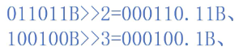

# 进制数

## 二进制

* 基数只有0和1

* 表示方式：后缀`B`或`b`，例如15表示为`1111B`。

* 运算

    * 加

      * 逢2进1
    * 减

      * 借1做2
    * 乘

      * 逐位相乘，移位相加，类似十进制的乘法
        
    * 除
      
    * 移位

      * 无符号
        * 左移，低位补0
          
        * 右移，高位补0
          

      * 有符号
        * 左移，低位补0
          
        * 右移，高位补符号位
          

## 八进制

* 基数从0 \~ 8
* 表示方式：以`0`开头，例如15表示为`017`。

## 十六进制

* 基数从0 \~ 15，其中10 \~ 15分别用A、B、C、D、E、F来表示
* 表示方式：前缀`0x`，例如15表示为`0xF`。
* 进制转换

  * 二进制转十进制

    * 按权求和
      

  * 十进制转二进制

    * 整数部分：辗转除二取余法（余数从上往下依次为低位到高位）
      
    * 小数部分：辗转乘二取整法（整数从下往上依次为低位到高位）
      

  * 二进制转十六进制

    * 小数点往左，每4位二进制数表示一位十六进制数
    * 小数点往右，每4位二进制数表示一位十六进制数

  * 十六进制转二进制

    * 将每位写成4位二进制数，按照原顺序排列

---

# 机器数和真值

- 机器数：一个数带符号的二进制表示形式
- 真值：机器数对应的十进制数值

---

# 机器存储数字的编码方式

## 原码

  * 第一位表示符号, 其余位表示真值的绝对值
  * 范围是 $[-(2^n - 1), 2^n - 1]$
  * 原码是人脑直接识别并用于计算的表示方式

## 反码

  * 正数的反码是其本身，负数的反码在其原码的基础上, 符号位不变，其余各个位取反
  * 反码的出现是为了让符号位参与运算，从而能够使用加法来实现减法，最终达到简化计算机基础电路的目的。

## 补码

  * 正数的补码就是其本身，负数的补码是在其原码的基础上, 符号位不变, 其余各位取反, 最后+1. (即在反码的基础上+1)
  * 补码是为了解决反码正负0的编码歧义，将反码负0的机器码表示成更低的真值，扩大了反码能够表示的最低范围。
  * 最终计算机采用补码来存储数据

## 编码方式之间的转换

* 原码转反码

  * 正数不变；负数的符号位不变，其余位取反。
* 反码转原码

  * 正数不变；负数的符号位不变，其余位取反。
* 反码转补码

  * 正数不变；负数加1；
* 补码转反码

  * 正数不变，负数减1；
* 原码转补码

  * 正数不变；负数的符号位不变，其余位取反，最后加1；
* 补码转原码

  * 正数不变；负数减1，然后符号位不变，其余位取反；

---

# 字符编码

* ASCII

  * 将字母、数字和其它符号编号，并用 7 位的二进制数来表示这个整数编号