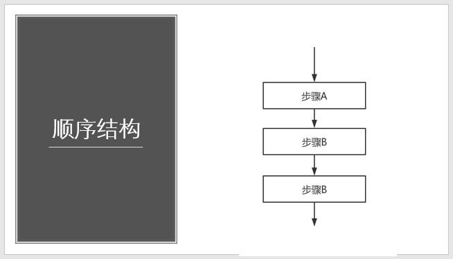
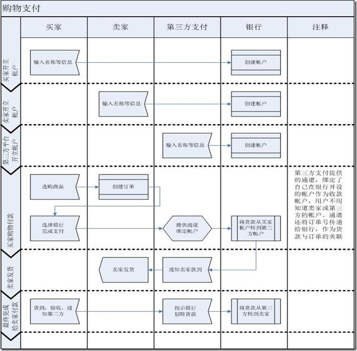

# 流程图介绍

- 流程图是用来直观地描述一个工作过程的具体步骤图，它使用图形表示流程思路。

- 常用一些图框来表示各种类型的操作，在框内写出各个步骤，然后用带箭头的线把它们连接起来，以表示执行的先后顺序，用图形表示执行步骤，十分直观形象，易于理解。

---

# 使用流程图的好处

- 能帮助梳理流程的先后顺序，让思路更清晰、逻辑更顺畅。

- 查漏补缺，避免逻辑上出现遗漏，确保流程的完整性。

- 高效地解决沟通问题。

---

# 流程图构成

## 流程图的符号

### 常用符号

### 基本符号

## 流程图的结构

### 顺序结构

  

### 选择结构

  

### 循环结构

- 当型结构

  当条件成立时，执行循环体流程，如此往复，直到条件不成立。

  

- 直到型结构

  先执行循环体流程，然后判断条件是否成立；当条件不成立时，再次执行循环体流程，直到条件成立，才结束。

  

---

# 绘制流程图的注意事项

1. 遵循从左到右、从上到下的顺序排列。

2. 一个流程从开始符开始，以结束符结束。开始符号只能出现一次，而结束符号可出现多次。若流程足够清晰，可省略开始、结束符号。

3. 菱形为判断符号，必须要有“是和否（或Y和N）”两种处理结果。且判断符号的上下端流入流出一般用“是（或Y）”，左右端流入流出用“否（或Y）”。

  

4. 同一流程图内，符号大小需要保持一致，同时连接线不能交叉，连接线不能无故弯曲。

5. 流程处理关系为并行关系的，需要将流程放在同一高度。

6. 必要时应采用标注，以此来清晰地说明流程，标注要用专门的标注符号。

7. 处理流程须以单一入口和单一出口绘制，同一路径的指示箭头应只有一个。

  
  

8. 流程图中，如果有参考其他已经定义的流程，不需重复绘制，直接用已定义流程符号即可。

---

# 示例

- 单个主体的任务流程图

  

- 多个主体的流程图（泳道图）

  

- 注释的使用

  