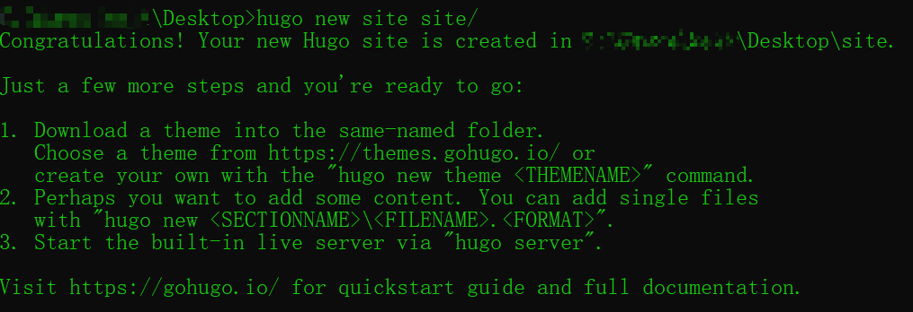
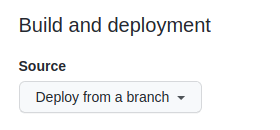
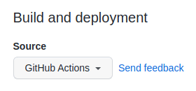
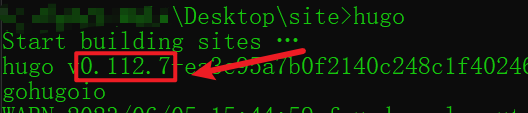
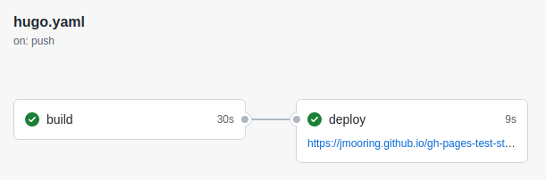

# 完整步骤

## 安装软件

* 安装 git

    [Git - Downloads (git-scm.com)](https://git-scm.com/downloads)
* 安装 hugo

    1. 下载对应个人操作系统的最新 hugo 二进制程序压缩包

        [Releases · gohugoio/hugo (github.com)](https://github.com/gohugoio/hugo/releases)
    2. 解压压缩包，然后把解压后路径添加到环境变量中

        [Windows 添加环境变量-CSDN 博客](https://blog.csdn.net/xue_nuo/article/details/114793534)
## 在本地创建一个 Hugo 站点

打开 cmd，输入以下命令在指定文件夹下创建新的 hugo 站点

```bash
hugo new site yourpath/
```

​​

## 给站点添加主题

1. 挑选一个满意的主题，然后拷贝它的 git 地址

2. 进入你站点目录的 themes 文件夹下，然后创建一个以你挑选的主题名字命名的子文件夹

3. 打开 cmd，进入你的站点目录，输入以下命令添加主题代码

    ```bash
    git submodule add theme_git_url themes/your_theme_name/
    ```

4. 把主题配置添加到 `hugo.toml`​​，注意修改 `your_theme_name`​​为你自己挑选的主题名称

    ```toml
    theme = 'your_theme_name'
    ```

5. 测试站点

    打开 cmd，进入你的站点目录，然后输入 `hugo server`​​命令启动站点

## 创建一个 GitHub Pages project

1. 创建一个 github 仓库

2. 注意仓库名称格式必须是 `你的github名称.github.io`​​

## 把你的本地站点推送到 GitHub Pages project

1. 打开 cmd，进入你的站点目录，然后输入下面命令把你的站点目录初始化为本地 git 仓库

    ```bash
    git init -b main
    ```

2. 提交代码

3. 添加远程仓库

    ```bash
    git remote add origin your_git_url
    ```

4. 推送本地代码到远程仓库

    ```bash
    git pull --rebase origin main
    git push origin main
    ```

## 在 GitHub Pages project 上部署你的站点

1. 访问你的 GitHub Pages project。在主菜单中选择 **Settings** > **Pages，然后找到**

    ​​

2. 把 `Deploy from a branch`​ 更改为 `GitHub Actions`​

    ​

3. 进入你本地站点目录，创建 `.github` ​文件夹，然后在 `.github` ​文件夹下创建 `workflows` ​文件夹，最后在 `workflows` ​文件夹下创建 `hugo.yaml` ​文件

4. 打开 cmd，进入你的站点目录，然后输入 `hugo`​ 命令获取 hugo 版本

    ​​

5. 把一下内容复制到 `hugo.yaml` ​文件里，同时修改项 `HUGO_VERSION` ​的值为你自己的 hugo 版本号

    ```yaml
    # Sample workflow for building and deploying a Hugo site to GitHub Pages
    name: Deploy Hugo site to Pages

    on:
      # Runs on pushes targeting the default branch
      push:
        branches:
          - main

      # Allows you to run this workflow manually from the Actions tab
      workflow_dispatch:

    # Sets permissions of the GITHUB_TOKEN to allow deployment to GitHub Pages
    permissions:
      contents: read
      pages: write
      id-token: write

    # Allow only one concurrent deployment, skipping runs queued between the run in-progress and latest queued.
    # However, do NOT cancel in-progress runs as we want to allow these production deployments to complete.
    concurrency:
      group: "pages"
      cancel-in-progress: false

    # Default to bash
    defaults:
      run:
        shell: bash

    jobs:
      # Build job
      build:
        runs-on: ubuntu-latest
        env:
          HUGO_VERSION: 0.111.3
        steps:
          - name: Install Hugo CLI
            run: |
              wget -O ${{ runner.temp }}/hugo.deb https://github.com/gohugoio/hugo/releases/download/v${HUGO_VERSION}/hugo_extended_${HUGO_VERSION}_linux-amd64.deb \
              && sudo dpkg -i ${{ runner.temp }}/hugo.deb        
          - name: Install Dart Sass Embedded
            run: sudo snap install dart-sass-embedded
          - name: Checkout
            uses: actions/checkout@v3
            with:
              submodules: recursive
              fetch-depth: 0
          - name: Setup Pages
            id: pages
            uses: actions/configure-pages@v3
          - name: Install Node.js dependencies
            run: "[[ -f package-lock.json || -f npm-shrinkwrap.json ]] && npm ci || true"
          - name: Build with Hugo
            env:
              # For maximum backward compatibility with Hugo modules
              HUGO_ENVIRONMENT: production
              HUGO_ENV: production
            run: |
              hugo \
                --gc \
                --minify \
                --baseURL "${{ steps.pages.outputs.base_url }}/"        
          - name: Upload artifact
            uses: actions/upload-pages-artifact@v1
            with:
              path: ./public

      # Deployment job
      deploy:
        environment:
          name: github-pages
          url: ${{ steps.deployment.outputs.page_url }}
        runs-on: ubuntu-latest
        needs: build
        steps:
          - name: Deploy to GitHub Pages
            id: deployment
            uses: actions/deploy-pages@v2
    ```

6. 提交代码并推送到远程仓库

7. 在你的 GitHub Pages project 的主菜单，选择 **`Actions`** ​然后点击最新一笔提交，可以看到正在进行构建和部署，部署完以后就能够访问了

    ​​

    ​​

8. 打开浏览器，输入地址 `https://your_github_name.github.io` ​来访问你的博客

# 参考资料

* [Host on GitHub | Hugo (gohugo.io)](https://gohugo.io/hosting-and-deployment/hosting-on-github/)