# 什么是开源许可证

开源许可证是对开源软件的使用、复制、修改和再发布等行为进行限制的一份法律许可。

---

# 为什么要有开源许可证

目的在于规范受著作权保护的软件的使用或者分发行为。

---

# 常见开源许可证

- BSD

- MIT

- Apache

- GPL

- MPL

---

# 如何选择开源许可证

---

# 常见开源许可证的差异

---

# 参考

* [一文看懂开源许可证丨开源知识科普 | PingCAP](https://cn.pingcap.com/blog/introduction-of-open-source-license/)

* [如何选择开源许可证？ - 阮一峰的网络日志 (ruanyifeng.com)](https://www.ruanyifeng.com/blog/2011/05/how_to_choose_free_software_licenses.html)

* [各种开源协议介绍 | 菜鸟教程 (runoob.com)](https://www.runoob.com/w3cnote/open-source-license.html)