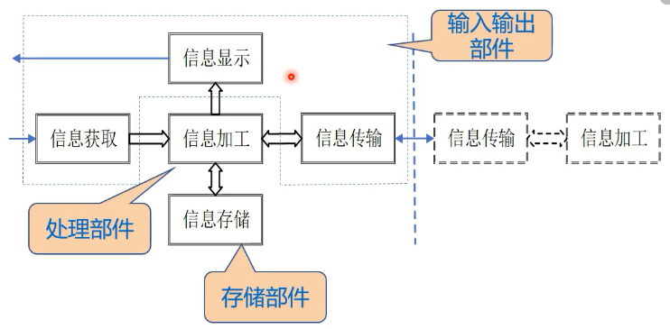
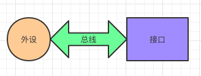

# 信息处理系统

## 信息处理系统的构成

- 处理部件
  > 负责处理输入信息、输出处理后的结果、控制信息的存储以及管理信息的共享。

- 存储部件
  > 存储信息的部件
- 输入输出部件

  - 信息输入部件
  - 信息输出部件
  - 信息传输部件

## 信息处理电路

- 信息处理电路
  > 将输入电路量通过相应的处理电路产生新的电路量

- 信息存储电路
  > 将电路量通过介质传递到另一方

- 信息获取电路
  > 将物理量变成电路量。比如，光电传感器、声电传感器、压电传感器

- 信息输出电路
  > 将电路量变成物理量

---

# 微处理器系统

## 微处理器系统结构

- 处理器
  > 读取并执行指令代码完成具体操作的数字处理单元

- 存储器
  > 保存程序和数据的存储设备

- 外设
  > 外部输入输出设备

- 外设接口
  > 某外设服务的多个寄存器构成的部件
  > 处理器对外设操作的实质是对接口中的寄存器进行操作

- 总线
  > 计算机各种功能部件之间传送信息的公共通信干线
  > 分为数据总线、地址总线和控制总线，分别用来传输数据、数据地址和控制信号

### 外设、外设接口、总线之间的关系

## 基于微处理器的程序化信息处理方式

由硬件系统和软件系统构成，硬件系统是实体部件，软件系统是用程序来控制硬件实现功能。